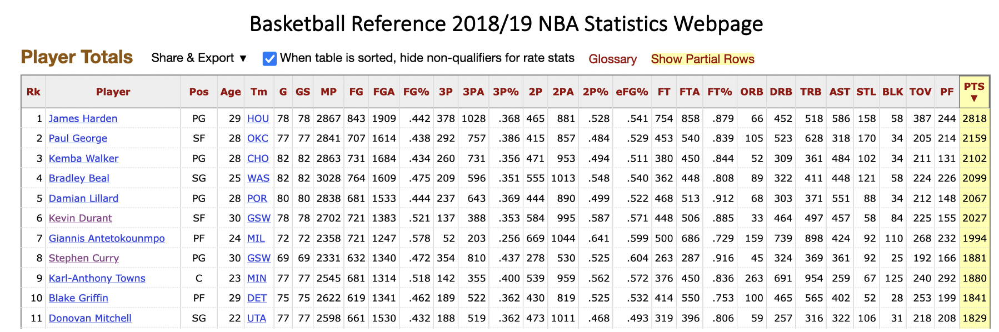
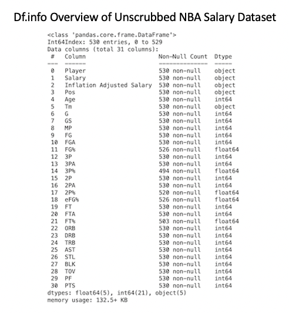
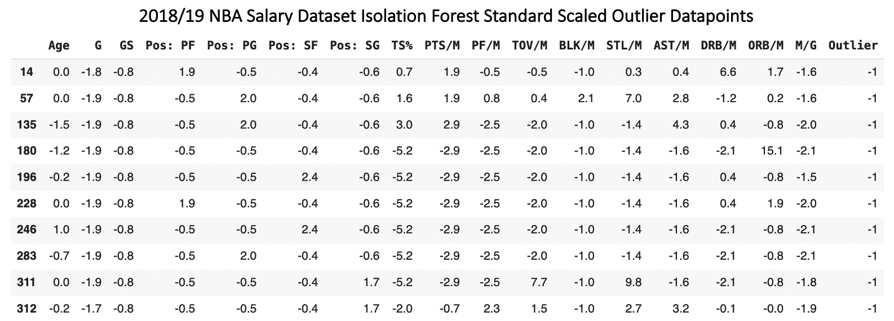
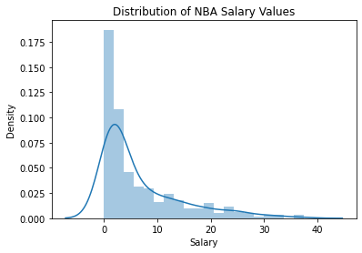
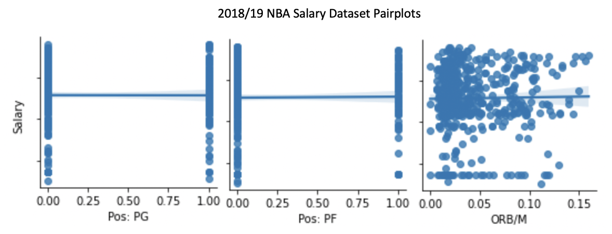
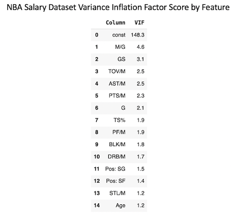
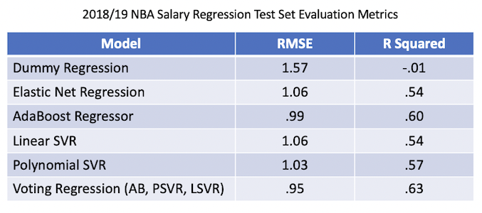
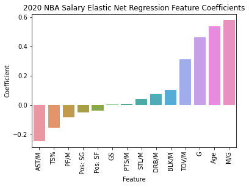

# 2018/19 NBA Salary Player Prediction Regression

## Introduction
I sought to build a regression model that could predict the salary of NBA players based upon their game statistics. This model could assist NBA teams in the process of signing free agents during the off season in a couple of ways. Firstly, it could estimate a player’s fair value salary by predicting the market value for that player. The model would also predict the salary that other teams would offer free agents helping teams to avoid misbidding on contracts. With this modeling objective, I was more interested in maximizing performance than model interpretation.

I scraped 2018/19 NBA game statistics from Basketball Reference and 2018/19 NBA salary data from HoopsHype. As part of the data scrubbing process, I dropped all players that had played in 5 or fewer games during the season. These datapoints with a small sample size of playing time had high variance and were difficult to model, which made dropping them the right choice. I also log transformed the Salary dependent variable in order to reduce the large number of outliers caused by the the variable’s long tail distribution. After scrubbing, the dataset included 487 datapoints across 15 features.

I built Linear Regression, Support Vector Regression, AdaBoost, Random Forest and XGBoost models. All of these outperformed the baseline Mean Predicting Dummy Regressor model’s test set evaluation metrics (RMSE: 1.57, R Squared: -.01). The top performing individual model was the AdaBoost Regressor (RMSE: .99, R Squared: .60), while the top performing overall model was an AdaBoost/Polynomial SVR/Linear SVR Voting Regressor (RMSE: .95, R Squared: .63)

## Obtain Data

I scraped NBA game statistics for the 2018/19 season from the Basketball Reference website. I obtained 2018/19 NBA player salaries through a scrape of the HoopsHype website. After scrubbing player names from the two datasets to match, I merged them together. This resulted in 530 pre-scrubbing datapoints across 31 features.

## Scrub Data

In order to scrub the NBA salary dataset, I first dropped features not useful for modeling. I next reclassified multipositional players based on their first listed position and created dummy variables for the Position feature. I calculated a single interaction feature, True Shooting Percentage, to encompass all shooting features and dropped the variables that this interaction replaced. I also divided all possible features by Minutes to make them comparable across players playing in different numbers of games or minutes per game.

I used isolation forest to find the greatest outlier datapoints in the dataset. Observing the results of this modeling, I noticed that most outlier players had played in 5 or fewer games (-1.7 standard deviations from the mean or greater), as their small play time sample size led to a large amount of variance in their statistics. I dropped all players that had played in 5 or fewer games from the dataset. I also replaced all datapoint values greater than 4 standard deviations from the mean with the 4 standard deviation value. This was likely to mitigate the normal reduction in model performance caused by values far from their feature means. After scrubbing, the dataset included 487 datapoints across 16 features.

## Explore Data

When plotting the distribution of the Salary dependent variable, I noticed a long tail distribution with a large number of upper outliers. I log transformed Salary in order to reduce the number of outliers. Models can struggle to predict outlier values, so I thought a log transformation was likely to improve model performance and preliminary modeling confirmed that it did.

I next plotted each of the feature relationships with the dependent variable. This revealed three features, Pos: PG, Pos: PF and ORB/M, with little relationship to the Salary dependent variable. I dropped these three features in order to avoid the reduction in model performance that unnecessary features can cause.

I finally calculated Variance Inflation Factor for all features in order to determine if any of them needed to be dropped due to to high correlation. Minutes/Game had the highest VIF at 4.7, meaning that no features needed to be removed from the dataset.

## Model Data

I built Linear Regression, Support Vector Regression, AdaBoost, Random Forest and XGBoost models. These all outperformed the test set evaluation metrics of the baseline Mean Predicting Dummy Regressor model (RMSE: 1.57, R Squared: -.01). The AdaBoost Regressor (RMSE: .99, R Squared: .60) was the top performing individual model, while an Adaboost/Polynomial SVR/Linear SVR Voting Regressor (RMSE: .95, R Squared: .63) was the top performing overall model. This model’s strong R Squared value above .6 meant that it was of value in predicting NBA player salaries.

Elastic Net Regression was the top performing model with feature coefficients (RMSE: 1.06, R Squared: .54). Its feature coefficients revealed that playing volume was the most important predictor of salary. Minutes/Game (Coefficient: .58) and Games Played(Coefficient: .46) were the first and third most influential coefficients. Age (Coefficient: .54) was the second most influential feature, likely due to NBA rules that increase salary ranges as players get older.

The most positively influential efficiency statistic on Salary was Turnovers/Minute (Coefficient: .31), while the most negatively influential efficiency statistic was Assists/Minute (Coefficient: -.25). These features had the opposite effect on salary versus what I would have expected since turnovers are a negative event in basketball while assists are a positive event. Turnovers and assists are also strongly correlated features (Correlation: .6), so it’s likely that the Linear Regression model was overfitting to two features that were largely cancelling each other out. These features did improve performance in the best individual AdaBoost model, so I didn’t drop them from the modeling process. Overall, the vast majority of Elastic Net’s outperformance versus the baseline model was driven by the three features of Minutes/Game, Games Played and Age.

## Conclusion

I set out to build a regression model that could use NBA player statistics to predict salaries in the 2018/19 season. The top performing Voting Classifier with AdaBoost, Polynomial SVR and Linear SVR components was successful in outperforming the baseline Mean Predicting Dummy Regressor (RMSE: .95 vs. 1.57, R Squared: .63 vs. -.01). Three features, Minutes/Game, Games Played and Age, yielded the vast majority of model performance versus the baseline Dummy Regressor. Due to the large number of other features in the model, there was likely some overfitting to these features.

Although I didn’t have enough time for extensive wrapper feature selection, removing some of these extra features would likely yield modest improvements in model performance. I’d also be curious to try building a model using only player efficiency metrics with the three top features removed. This would provide insight into how well player efficiency statistics predict salary when they’re not crowded out by playing time statistics. While regression modeling was successful in providing meaningful predictions of NBA player salaries using playing statistics, this additional modeling could provide even more insight.

# Github Files
[Scrape.ipynb](https://github.com/blantj/nba_salary_regression/blob/main/Scrape.ipynb) : 2018/19 NBA Player Salary Data Scrape

[NBA_Salary_Modeling.ipynb](https://github.com/blantj/nba_salary_regression/blob/main/NBA_Salary_Modeling.ipynb) : 2018/19 NBA Player Salary Prediction Regression

# Sources
Basketball Reference: https://www.basketball-reference.com/leagues/NBA_2019.html

HoopsHype: https://hoopshype.com/salaries/2018-2019/
